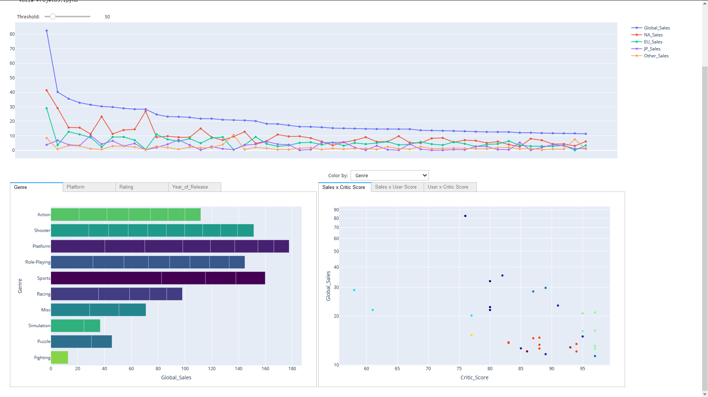
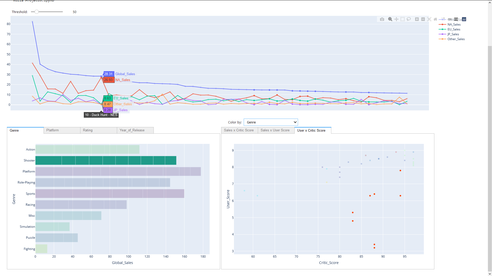
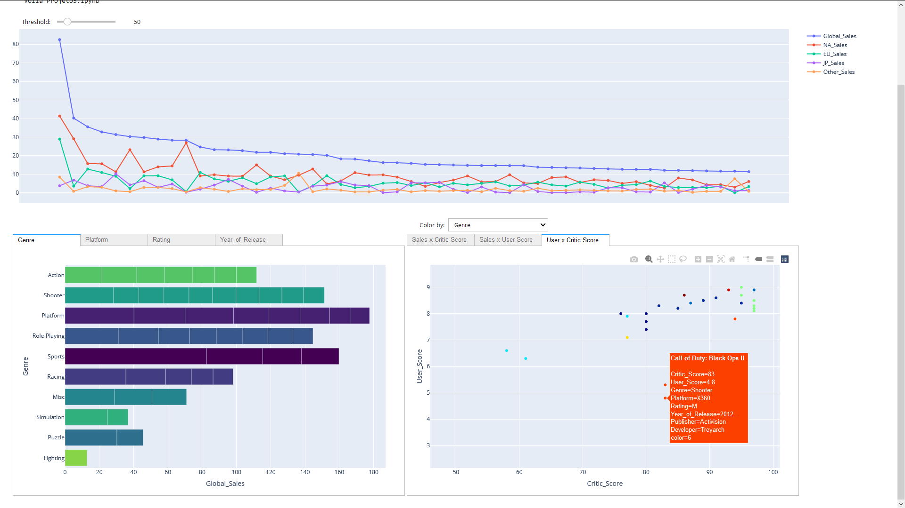
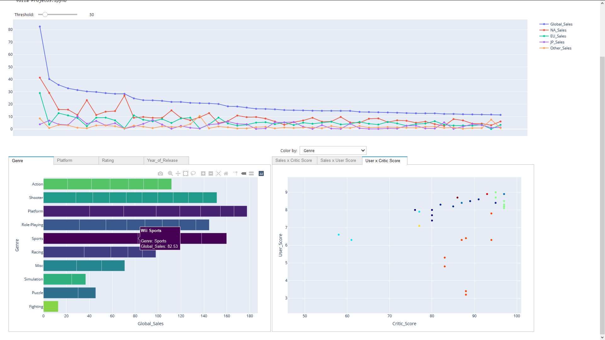

# SCC0652 Visualização Computacional

## Projeto - Etapa 3: Interação com os Dados

## Grupo:
- Alexandre Norcia Medeiros - nUSP: 10295583
- Gabriel Alfonso Nascimento Salgueiro - nUSP: 10284368

## Arquivos
- [Projeto3.ipynb](./Projeto3.ipynb): Jupyter Notebook onde o sistema foi desenvolvido.
- [p3.py](./p3.py): Codigo separado em python do jupyter notebook
- [Documentação do Sistema.pdf](<./Documentação do Sistema.pdf>): Arquivo pdf que documenta a aplicação.
- [fille_Video_Games_Sales.csv](./fille_Video_Games_Sales.csv): Conjunto de dados que a aplicação permite visualizar.
- [screenshots](./screenshots): Pasta com imagens de exemplo da aplicação.

## Sobre o Projeto

Esse projeto é a etapa final do projeto da disciplina Visualização Computacinal. Nele, foi desenvolvido uma aplicação para a visualização de um conjunto de dados, o qual escolhemos [Video Games Sales with Ratings](https://www.kaggle.com/rush4ratio/video-game-sales-with-ratings). Nas etapas anteriores, foi realizada a exploração e o pré-processamento dos dados. Assim o arquivo [filled_Video_Games_Sales.csv](./filled_Video_Games_Sales.csv) foi feito com o conjunto já pré-processado.

Considerando tudo isso, esse repositório contém a etapa 3. Aqui, foi desenvolvida uma aplicação de visualização através de um [jupyter notebook](https://jupyter.org/), e para ser corretamente inicializada, deve ser executada através do [voila](https://voila.readthedocs.io/en/stable/) pelo comando:

    voila Projeto3.ipynb

Desta maneira, um servidor do voila será aberto e executará o notebook. A aplicação é aberta em uma nova aba no endereço http://localhost:8866/. Lá, ela será corretamente visualizada, sem as limitações da janela de display do jupyter notebook. 

A aplicação apresenta gráficos interativos feitos em cima do conjunto de dados. Nesses gráficos, é possível interagir com *hovering*, onde dados adicionais sobre o elemento selecionado são exibidos com destaque. Além disso, os gráficos também apresentam uma seleção compartilhada, onde é possível selecionar um conjunto de valores para que esses fiquem destacados através de todos gráficos. Vale notar também que é possível selecionar a quantidade de elementos exibidos através do seletor threshold.

## Imagens da Aplição Rodando

